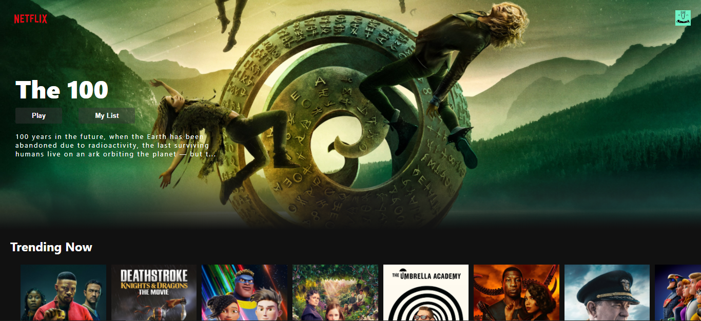
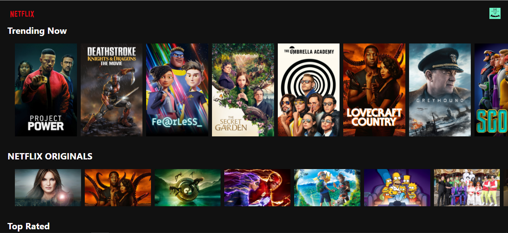
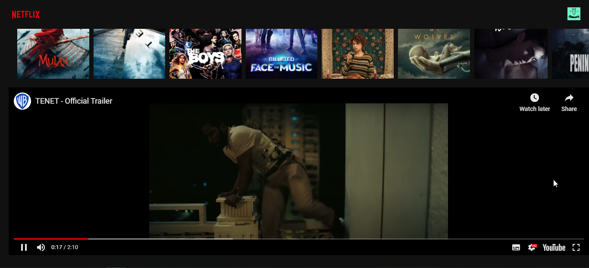

### I am making a clone series of popular webapps. Do follow me for more such clones. 😎😎😎

# 🔥🔥 NETFLIX WEBAPP CLONE MADE USING REACTJS 🔥🔥

## How to use it on your pc :

1. Clone this repo in your pc. </br> ``` git clone https://github.com/singhanuj620/netflix_clone ```
2. Install the dependencies. </br> ``` npm install ```
3. Run the code. </br> ``` npm start ```
4. Open Local Host <br> ```https://localhost:3000/```

### BINGO !! YOUR NETFLIX CLONE IS UP AND RUNNING 🙌🙌🙌🙌

## Features of this webapp :

1. Has various categories like *Trending*, *Action*, *Originals*, and many more
2. Has the **Trailer** mode, User can click on the thumbnail and watch the trailer direct in the webapp.

## Screenshots : 



🔥🔥🔥🔥🔥🔥🔥🔥🔥🔥🔥🔥🔥🔥🔥



🔥🔥🔥🔥🔥🔥🔥🔥🔥🔥🔥🔥🔥🔥🔥



🔥🔥🔥🔥🔥🔥🔥🔥🔥🔥🔥🔥🔥🔥🔥

# Follow me on Instagram :

## [AnujCodeOP](https://www.instagram.com/anujcodeop/)
